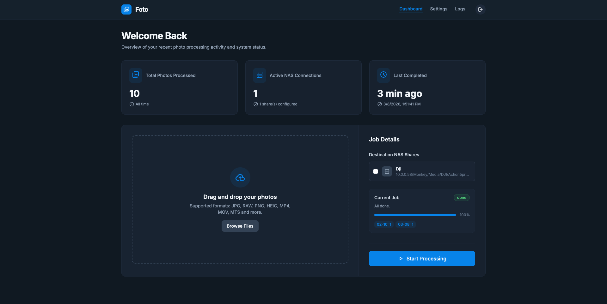
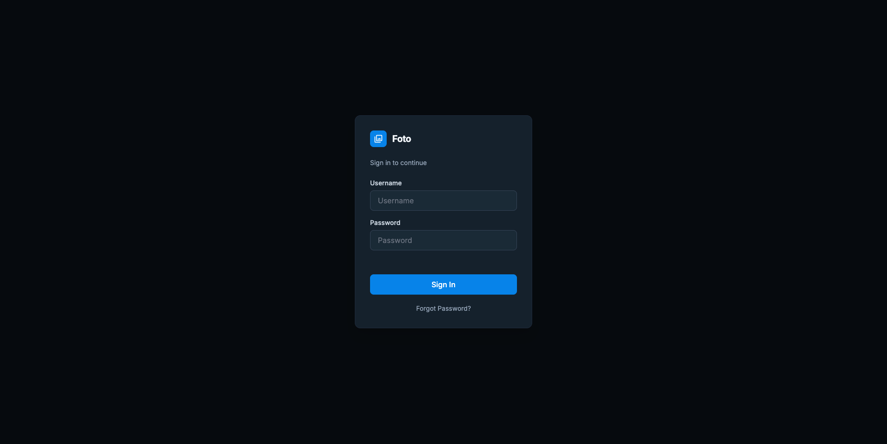
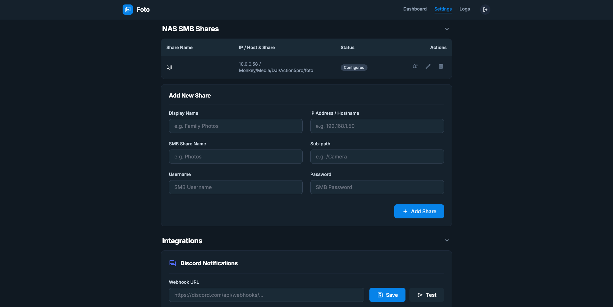
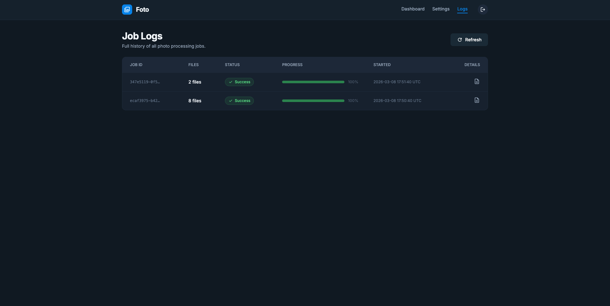
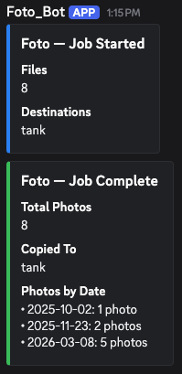

# Foto

Organize camera SD card photos by EXIF date and copy them to your NAS drives — all from a clean web UI running on your server.

Upload photos and videos from your browser, Foto reads the EXIF/metadata dates, sorts everything into dated folders, and copies them to as many NAS SMB shares as you want. Discord notifications keep you in the loop.



## Features

- **Drag & drop upload** — photos, RAW files, and videos (JPEG, CR2, NEF, ARW, DNG, HEIC, MP4, MOV, MTS, and more)
- **EXIF date sorting** — automatically organizes files into date folders using EXIF DateTimeOriginal, video creation date, or file modification time as fallback
- **Multiple NAS destinations** — copy organized folders to unlimited SMB shares simultaneously
- **Discord notifications** — job started, completed (with per-date photo counts), and error alerts
- **Configurable date formats** — MM-DD, MM.DD, MMDD, or YYYY-MM-DD folder naming
- **Duplicate handling** — automatically appends \_1, \_2, etc. for filename collisions
- **Timestamp preservation** — file creation and modification times are preserved on the NAS
- **Password protection** — HTTP Basic auth with PBKDF2 hashed passwords
- **Password reset** — 6-digit code via Docker logs or Discord webhook
- **Dark mode** — enabled by default, toggleable in settings
- **Job history & logs** — full activity log with live progress tracking

## Screenshots

### Login



### Settings — NAS Shares



### Job Logs



### Discord Notifications



## Quick Start

```bash
git clone https://github.com/ijoshi129/foto.git
cd foto
docker compose up -d
```

Open **http://YOUR_IP:8021** in your browser.

Default credentials:
| Field | Value |
|---|---|
| Username | `admin` |
| Password | `changeme` |

> Change your password immediately in Settings > Account Security.

## Setup

### 1. Add NAS Shares

Go to **Settings** and add your NAS SMB shares:

- **Display Name** — friendly label (e.g. "Family NAS")
- **IP Address** — your NAS IP (e.g. `192.168.1.50`)
- **SMB Share Name** — the shared folder name (e.g. `Photos`)
- **Sub-path** — optional subfolder within the share (e.g. `/Camera`)
- **Username / Password** — SMB credentials

Use the **Test** button to verify connectivity before saving.

### 2. Configure Discord (Optional)

Paste a Discord webhook URL in Settings > Integrations to receive job notifications. Use the **Test** button to confirm it works.

### 3. Upload & Process

1. Drag photos/videos onto the dashboard (or click Browse Files)
2. Select one or more destination NAS shares
3. Click **Start Processing**
4. Monitor progress in the UI or via Discord

## Configuration

### Environment Variables

| Variable | Default | Description |
|---|---|---|
| `FOTO_USERNAME` | `admin` | Initial login username (only used on first run) |
| `FOTO_PASSWORD` | `changeme` | Initial login password (only used on first run) |

### Ports

The app runs on port **8021** inside the container. Map it to any host port:

```yaml
ports:
  - "8080:8021"  # access on port 8080 instead
```

### Data Persistence

All config (NAS shares, settings, credentials) and job history are stored in `./data/`. This directory is created automatically and persists across container restarts and rebuilds. 
You can also change this directory to your preference. (Recommend)

```
data/
├── config.json   # shares, settings, auth
└── jobs.json     # job history
```

## Supported File Types

| Type | Extensions |
|---|---|
| Images | JPEG, PNG, TIFF, BMP, HEIC, HEIF |
| RAW | CR2, NEF, ARW, DNG, RAF, ORF, RW2 |
| Video | MP4, MOV, M4V, MTS, M2TS, AVI, MKV, WMV, FLV, WebM, 3GP |

Files without EXIF data fall back to filesystem modification time.

## Updating

```bash
git pull
docker compose up -d --build
```

Your data is preserved.

## License

MIT
# foto
